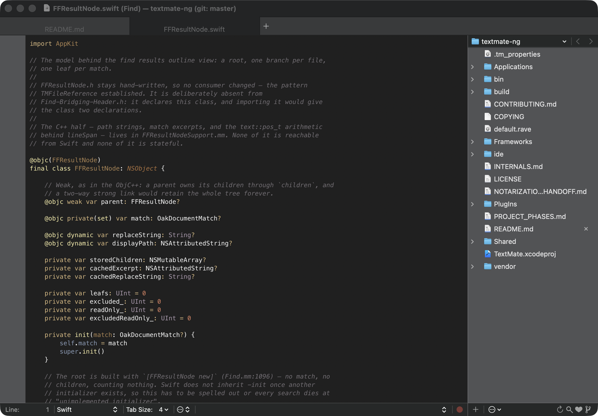

# TextMate-NG

A fork of [TextMate 2](https://github.com/textmate/textmate), being modernised
rather than rewritten. Three things are different from upstream:

* **It builds with Xcode.** The `rave`/ninja build system was retired
  2026-07-26 (tag `rave-final`) once the Xcode build reached parity.
* **It is being migrated to Swift, framework by framework.** The C++ text engine
  — buffer, editor, selection, layout, parser, regexp — is deliberately *kept*,
  behind Swift/C++ interop. It is the AppKit shell that is moving.
* **It has its own identity.** It installs as `TextMate-NG.app` with the bundle
  identifier `com.j23software.TextMate-NG`, so it coexists with an installed
  upstream TextMate rather than replacing it.

[`PROJECT_PHASES.md`](PROJECT_PHASES.md) is the roadmap and the progress tracker.

**Status: alpha.** The current release is `v2026.7-alpha.7` (2026-08-06). Release
notes for every build are in
[`Applications/TextMate/about/Changes.md`](Applications/TextMate/about/Changes.md).

## Screenshot



## Requirements

* **Apple Silicon.** Builds are `arm64`-only; Intel is not supported (see the
  "Decided" section of `PROJECT_PHASES.md` for why).
* **macOS 15 Sequoia or later.**

## Download

**[Latest release](https://github.com/johnmcgovern/textmate-ng/releases/latest)** —
builds are published here as pre-releases, signed with an Apple Developer ID and
notarized. Unzip, drag to `/Applications`, open.

Only alphas from `v2026.7-alpha.7` onwards are published. Earlier tags exist in
the history but were never released as downloads.

If you were looking for *upstream* TextMate 2, that is
[a separate download](https://macromates.com/download) from MacroMates.

## Installing a build

Builds have been signed with an Apple Developer ID and notarized since alpha.4,
so Gatekeeper accepts them with no workaround: unzip, drag to `/Applications`,
open. Using `ditto` preserves the signature and extended attributes if you prefer
the command line:

```sh
ditto -x -k TextMate-NG-<version>.zip /Applications/
```

Earlier versions of this file described clearing the quarantine flag with
`xattr -dr com.apple.quarantine`. That was needed when builds were ad-hoc signed;
it is not needed now, and if an install *does* get refused, that is a real signal
rather than something to work around. You can check what the system thinks:

```sh
spctl -a -vv /Applications/TextMate-NG.app
```

A good build reports `accepted` and `source=Notarized Developer ID`.

### What an alpha build still will not do

* **No software update.** The channels are unconfigured while the fork has no
  server of its own — a new build means downloading a new build.
* **No crash-report submission**, for the same reason.
* **Finder thumbnails are generic.** Quick Look *previews* do work — select a
  source file in Finder and press space, and it is syntax-highlighted using your
  installed bundles and TextMate-NG's current theme.

## Feedback

Bug reports and questions about **this fork** belong in
[its GitHub issues](https://github.com/johnmcgovern/textmate-ng/issues).

For questions about **upstream TextMate 2**, use
[the TextMate mailing list](https://lists.macromates.com/listinfo/textmate) or
[contact MacroMates](https://macromates.com/support). Upstream's
[writing bug reports](https://github.com/textmate/textmate/wiki/writing-bug-reports)
guide is worth reading before filing anywhere.

# Building

## Setup

To build TextMate-NG, you need the following:

 * [boost][]            — portable C++ source libraries
 * [Cap’n Proto][capnp] — serialization library
 * [multimarkdown][]    — marked-up plain text compiler (compiles the About pages)
 * [ragel][]            — state machine compiler
 * [sparsehash][]       — a cache friendly `hash_map`
 * the `xcodeproj` gem  — authors the generated `.xcodeproj`

```sh
brew install boost capnp google-sparsehash multimarkdown ragel
gem install --user-install xcodeproj
```

After installing dependencies, make sure you have a full checkout (including
submodules), then generate and build the Xcode project:

```sh
git clone --recursive https://github.com/johnmcgovern/textmate-ng.git
cd textmate-ng
export LANG=en_US.UTF-8 LC_ALL=en_US.UTF-8 RUBYOPT="-EUTF-8"
ruby ide/extract_specs.rb > ide/gen/specs.json && ruby ide/seed_xcodeproj.rb
xcodebuild -project TextMate.xcodeproj -target TextMate -configuration Release build
open build/Release/TextMate-NG.app
```

`TextMate.xcodeproj` is generated, not committed — regenerate it any time with
the two `ruby` commands above (`ide/extract_specs.rb` parses the `default.rave`
spec files that describe the target graph; `ide/seed_xcodeproj.rb` authors the
`.pbxproj` from that). Re-running is safe: it rebuilds the project from scratch.
Edit the generators under `ide/`, never the generated project.

That produces an ad-hoc signed build, which is fine for development. A
distributable build additionally needs `TM_CODE_SIGN_IDENTITY` and
`TM_DEVELOPMENT_TEAM` set, followed by `bin/notarize`.

## Running the test suite

```sh
xcodebuild test -project TextMate.xcodeproj -scheme AllTests -configuration Debug
```

The bundles are generated at seed time by `ide/gen_xctest.rb`, so **re-seed after
editing any test source** — `xcodebuild test` on its own compiles the previous
version of a test you just changed.

## Building from within TextMate

Open `TextMate.xcodeproj` in Xcode and use its own Run/Test actions (⌘R/⌘U). The
`.tm_properties`-driven ⌘B-to-build-a-ninja-target workflow described by older
versions of this document no longer applies.

# Legal

The source for TextMate is released under the GNU General Public License as published by the Free Software Foundation, either version 3 of the License, or (at your option) any later version.

TextMate is a trademark of Allan Odgaard.

[boost]:         http://www.boost.org/
[multimarkdown]: http://fletcherpenney.net/multimarkdown/
[ragel]:         http://www.complang.org/ragel/
[capnp]:         https://github.com/capnproto/capnproto.git
[sparsehash]:    https://code.google.com/p/sparsehash/
